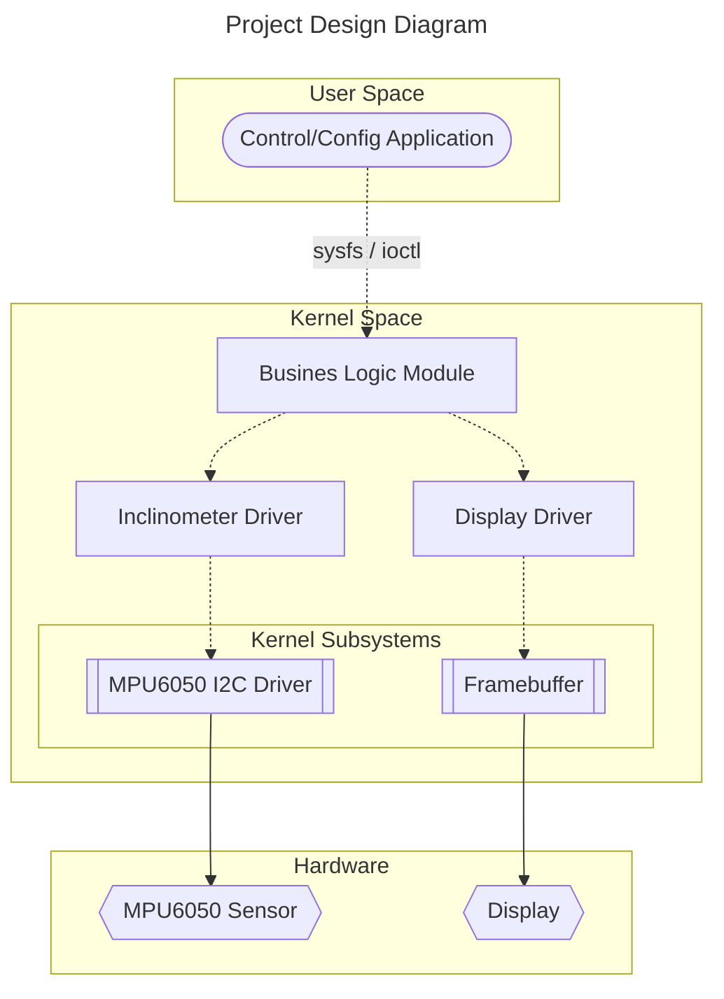
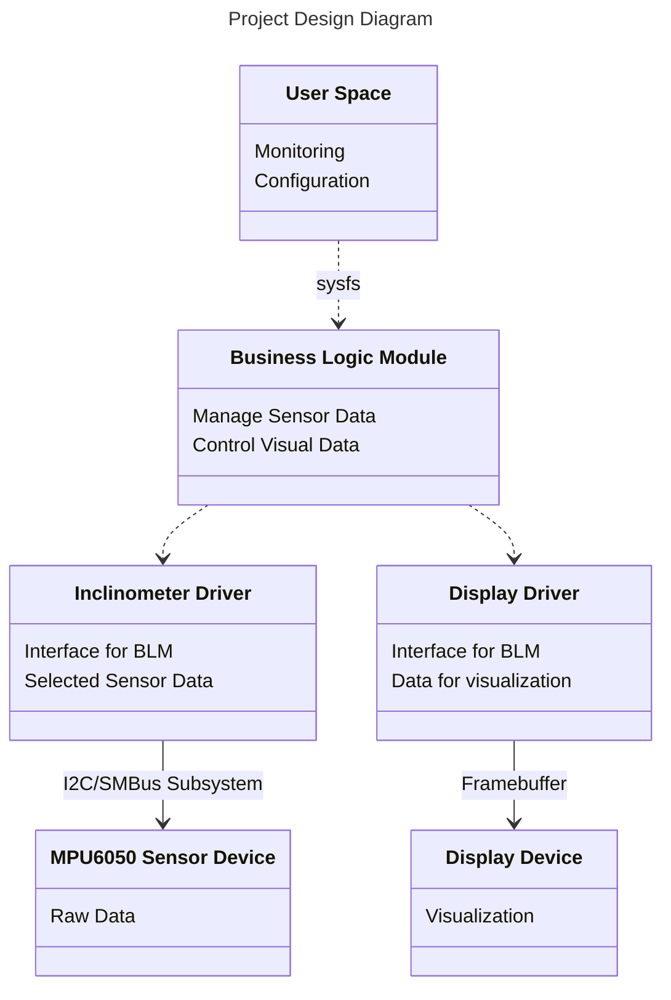

# GL Kernel BaseCamp Project

### Project Design





### Inclinometer Driver Interface

Data to be exported:

```c
struct inclinometer_data {
	int16_t gyro_x;
	int16_t gyro_y;
	int16_t gyro_z;
};

int16_t inclinometer_get_gyro_x();
int16_t inclinometer_get_gyro_y();
int16_t inclinometer_get_gyro_z();
```

