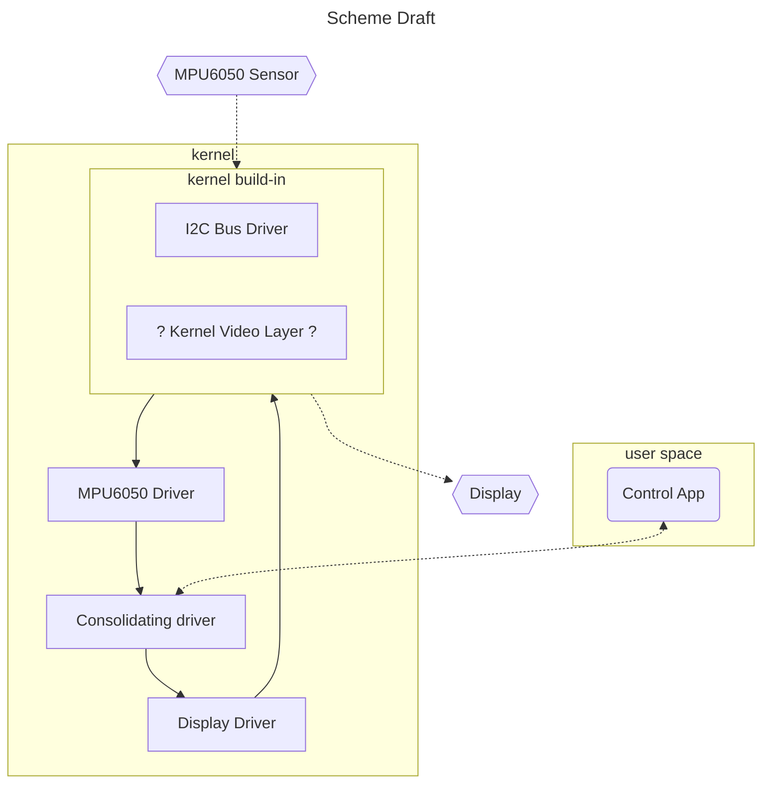

# GL Kernel BaseCamp Project

```mermaid
---
title: Scheme Draft
---
flowchart
    mpu{{MPU6050 Sensor}}
    display{{Display}}
    
    subgraph user space
      control(Control App)
    end

    subgraph modules [kernel]
      con[Consolidating driver]
      mpu_driver[MPU6050 Driver]
      display_driver[Display Driver]
      
      subgraph kernel [kernel build-in]
        i2c_driver[I2C Bus Driver]
        fb[? Kernel Video Layer ?]
      end
    end
    
    mpu -.-> kernel --> mpu_driver --> con
    con --> display_driver --> kernel -.-> display
    control <-.-> con
    
```
