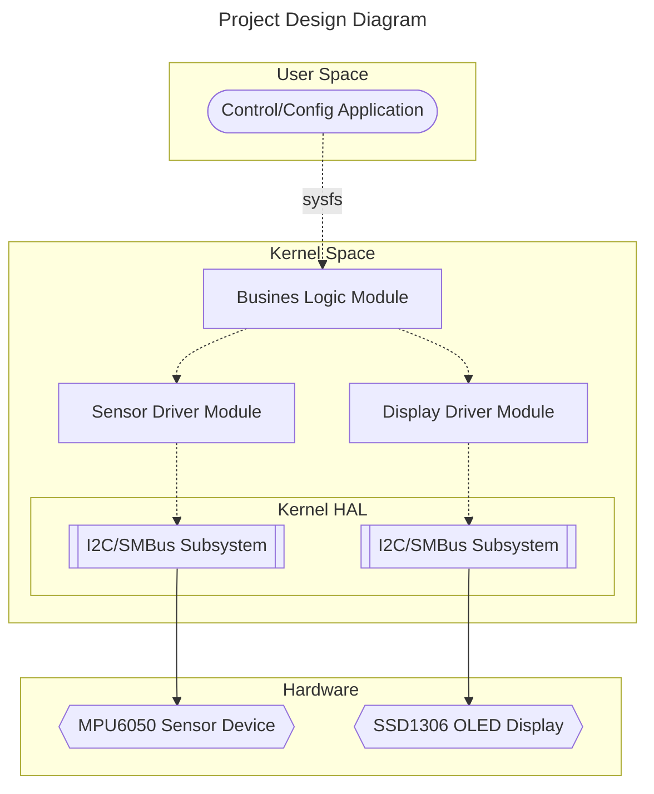
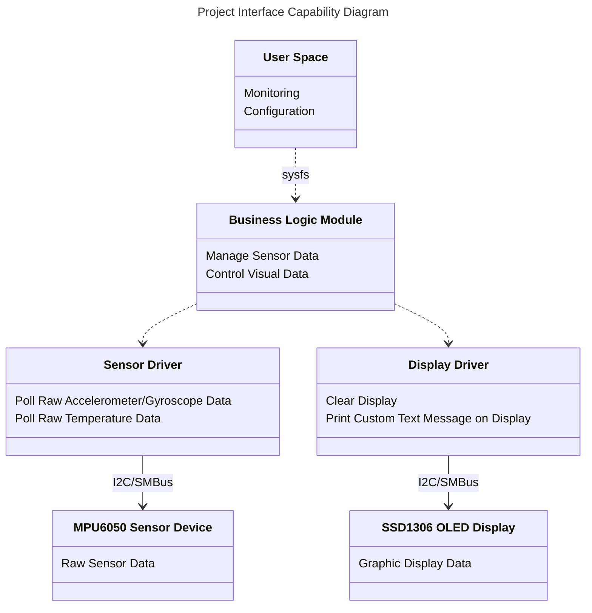

### GlobalLogic Linux Kernel BaseCamp Project
# Simple Inclinometer

An inclinometer is a device used to measure the angle of slope or inclination of an object with respect to the horizontal plane. It is also known as a tilt sensor, clinometer or slope meter. Inclinometers can be used in a wide range of applications, from measuring the pitch and roll of aircraft and ships to monitoring the angle of a drilling rig or the tilt of a building or bridge.

This project combines two devices. An OLED matrix with SSD1306 display controller to display data from MPU6050 sensor module in real-time.

The MPU6050 is a 6-axis gyroscope and accelerometer sensor module. It can measure both linear acceleration and angular velocity in three dimensions, providing accurate motion tracking data.

The SSD1306 is a single-chip CMOS OLED/PLED driver with controller for organic/polymer light emitting diode dot-matrix graphic display system. It consists of 128 segments and 64 commons.

## Project Design

This project uses three Linux kernel modules:

- **Sensor driver module** for reading information from the sensor
- **Display driver module** for displaying information on the screen
- And also a **Business logic module** for the linking these two modules and interaction with user space

_Perhaps this is an overloaded scheme, because modules should have as few dependencies as possible and interact with userspace directly. But the goal of this project is to get acquainted with writing Linux kernel modules, so it was decided to abandon the classic scheme in order to get acquainted with the interaction of modules in the kernel space._

