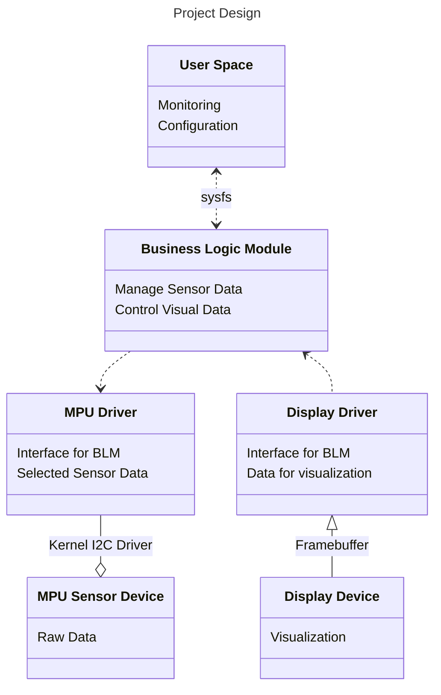
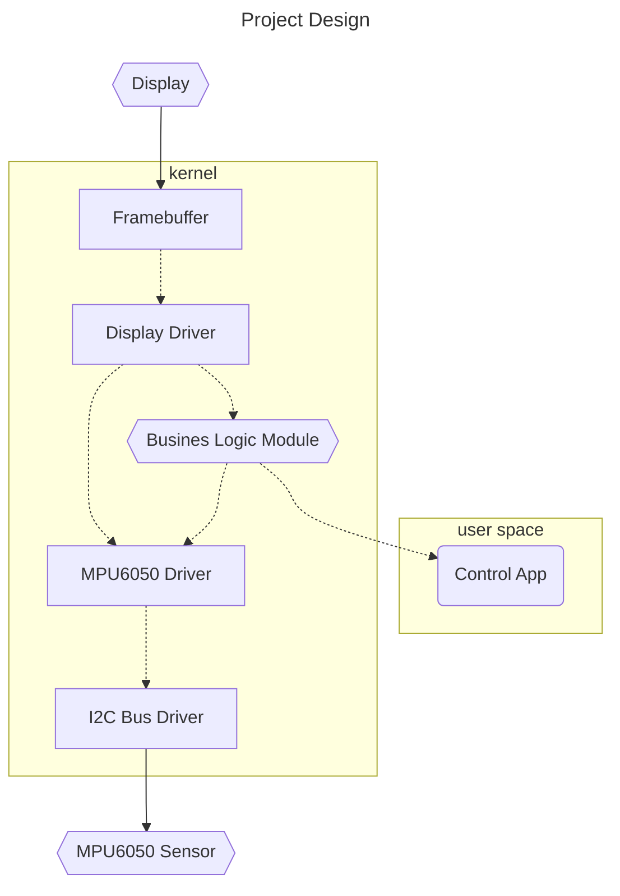

# GL Kernel BaseCamp Project

```mermaid
---
title: Project Design
---
classDiagram
   
    class `User Space` {
        Monitoring
        Configuration
    }

    class `Business Logic Module` {
        Manage Sensor Data
        Control Visual Data
    }
    %%link `User Space` "https://www.github.com/deesync"

    class `Display Driver` {
        Interface for BLM
        Data for visualization
    }

    class `MPU Driver` {
        Interface for BLM
        Selected Sensor Data
    }

    class `Display Device` {
        Visualization
    }

    class `MPU Sensor Device` {
        Raw Data
    }

    `User Space` <..> `Business Logic Module` : sysfs

    `Business Logic Module` ..> `MPU Driver`
    `Business Logic Module` <.. `Display Driver`

    `MPU Driver` --o `MPU Sensor Device` : Kernel I2C Driver
    `Display Driver` <|-- `Display Device` : Framebuffer
```

```mermaid
---
title: Project Design
---
flowchart
    mpu{{MPU6050 Sensor}}
    display{{Display}}
    
    subgraph uspace [user space]
      control(Control App)
    end

    subgraph modules [kernel]
      bl{{Busines Logic Module}}
      mpu_driver[MPU6050 Driver]
      display_driver[Display Driver]
      
      i2c_driver[I2C Bus Driver]
      fb[Framebuffer]
    end
    
    bl -.-> mpu_driver -.-> i2c_driver --> mpu
    display --> fb -.-> display_driver -.-> bl
    bl -.-> control
    display_driver -.-> mpu_driver
```

