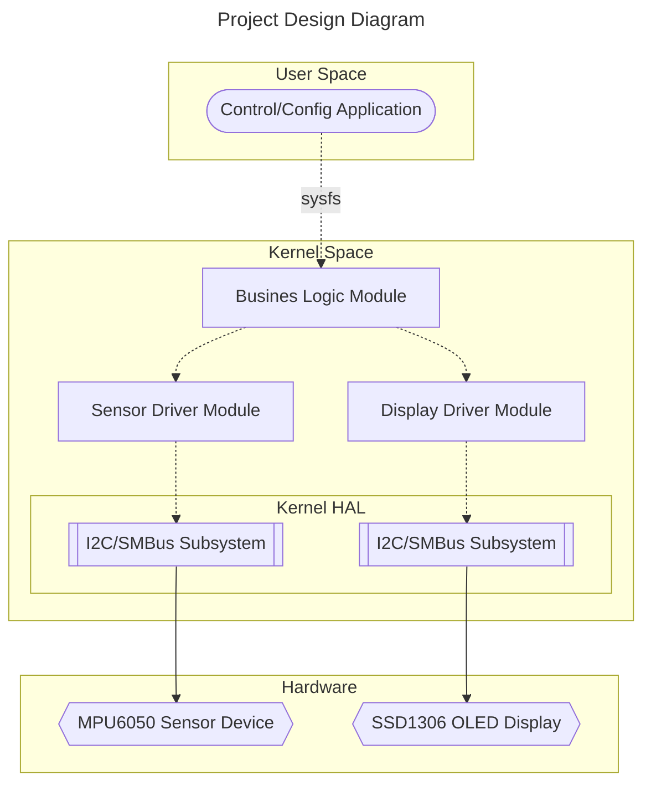
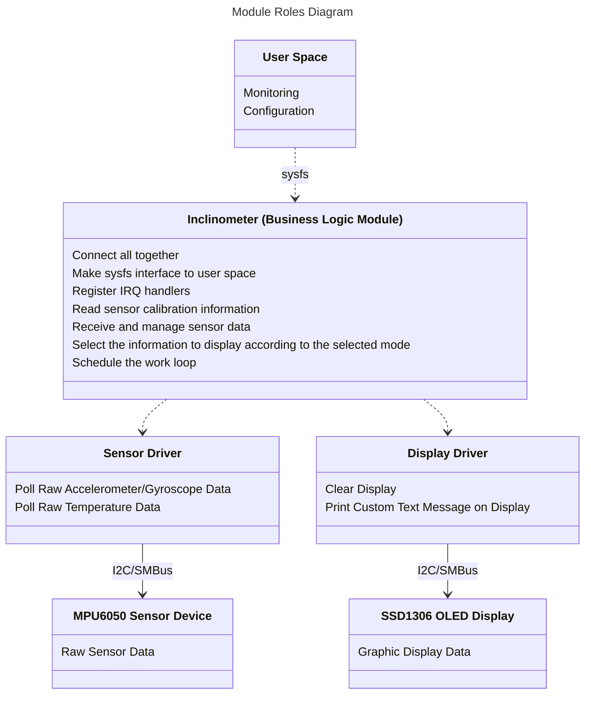

## Project Design

This project uses three Linux kernel modules:

- **Sensor driver module** for reading information from the sensor
- **Display driver module** for displaying information on the screen
- And also a **Business logic module** for the linking these two modules and interaction with user space

_Note: modules should have as few dependencies as possible and interact with userspace directly. But the goal of this project is to get acquainted with writing Linux kernel driver modules, so this approach was chosen intentionally._

